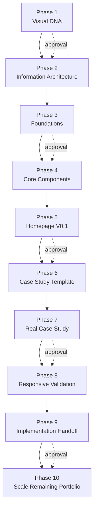
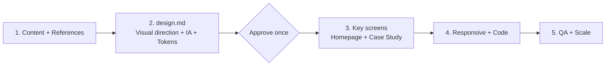

# Editorial Portfolio × Codex Workflow

这是一个由 Codex 辅助完成的 Product Designer 作品集实验。项目不只关注最终网页，也记录了从视觉方向、信息架构、设计系统、Figma 页面到响应式前端实现的完整过程，以及长流程中出现的 token 消耗问题。

## 项目目标

项目的目标是建立一个兼具编辑感与系统感的个人作品集，使招聘者能够快速理解设计师的定位、代表项目与思考方式，同时保证内容公开安全、设计规则统一，并能够从 Figma 稳定转换为生产代码。

最终方向为 **Warm Technical Editorial**：

- Instrument Serif 承担编辑感与表达性标题；
- IBM Plex Sans 保证正文可读性；
- IBM Plex Mono 用于导航、编号、状态与系统语言；
- 暖纸色背景、近黑文本、锈红强调色与琥珀状态色；
- 通过网格、细分隔线和留白建立层级，避免过度卡片化；
- 对企业项目名称、系统名称与截图进行公开化处理。

当前代码实现包含响应式首页，支持桌面与移动布局、移动菜单、锚点导航、键盘焦点、减少动态效果设置和语义化内容结构。

## 技术栈

- Astro
- TypeScript
- 原生 CSS 与 semantic design tokens
- 自托管 Instrument Serif、IBM Plex Sans、IBM Plex Mono
- Phosphor Icons

## 使用的 Skills

| Skill | 用途 |
|---|---|
| `portfolio-editorial-ai-workflow` | 主工作流；定义 Visual DNA → IA → Design System → Homepage → Case Study → Responsive → Implementation 的审批门槛。 |
| `figma-use` | 在 Figma 中创建和维护变量、文本样式、组件、页面与响应式设计。 |
| `product-design:image-to-code` | 将已批准的桌面与移动视觉稿实现为响应式前端。 |
| `browser:control-in-app-browser` | 在真实浏览器中验证页面、导航、移动菜单、响应式断点和控制台错误。 |
| `openai-docs` | 核对长上下文、reasoning tokens 与 compaction 等 token 管理信息。 |

## Phase 1–10

| Phase | 阶段 | 目标与产出 |
|---:|---|---|
| 1 | Visual DNA | 分析参考图的气质、字体角色、颜色、网格、留白、系统语言以及应该借用或避免的模式。 |
| 2 | Information Architecture | 确定首页、Selected Work、About、Contact 和案例页的信息层级，并建立 Evidence → Insight → Decision → Design → Outcome 的叙事结构。 |
| 3 | Foundations | 在 Figma 中建立语义色彩、字体样式、间距、圆角、边框和桌面网格，形成最小设计系统。 |
| 4 | Core Components | 创建 System Label、Action、Navigation Item、Metadata、Metric、Section Header、Status Bar 和 Media Frame 等作品集组件。 |
| 5 | Homepage V0.1 | 使用真实且公开安全的内容完成桌面首页，验证设计系统能否形成一致的页面语言。 |
| 6 | Case Study Template | 建立可复用的案例模板，覆盖 Context、Discovery、Definition、Design、System、Outcome 和 Reflection。 |
| 7 | Real Case Study | 将 Enterprise Travel Platform 的真实材料映射进模板，区分保留、强化、删除、缺失证据和保密内容。 |
| 8 | Responsive Validation | 将桌面层级重新组织为移动布局，而不是简单缩小；完成移动首页和案例页关键区段。 |
| 9 | Implementation Handoff | 把 Figma tokens 映射为 CSS variables，把组件映射为代码组件，并完成 Astro 响应式首页与浏览器 QA。 |
| 10 | Scale | 复用已批准的系统扩展剩余案例、About、Contact、实验项目和生产级完善。本仓库目前停在 Phase 9 首页实现。 |

## 原始流程图



每个阶段都需要检查、生成、截图、说明和人工批准。这提高了可控性，但也成为 token 成本的重要来源。

## 遇到的问题：token 消耗量巨大

项目可以成功推进，但 token 使用量远高于预期。即使在中途减少输出、限制检查范围并使用状态文件后，整体消耗仍然很大。

### 问题产生的原因

1. **阶段数量过多**：十个阶段意味着十轮上下文延续、交付说明、截图和批准，早期信息会不断进入后续上下文。
2. **过早直接操作 Figma**：Codex 在确定整体方向之前就需要读取页面、查找 node ID、检查 variables、创建组件、截图并反复修正。
3. **Figma 操作本身上下文密集**：每次写入都依赖已有节点、组件属性、变量 ID、字体和布局信息，工具返回内容会快速累积。
4. **审批门槛过细**：阶段门槛可以降低设计漂移，但每次停顿与恢复都需要重新建立当前状态。
5. **视觉 QA 成本高**：桌面、移动、案例页和实现稿都需要截图、结构检查、隐私检查与对照修复。
6. **同一事实被多种载体重复表达**：Figma、PNG、handover、状态 JSON、聊天历史和代码中保存了相似信息。
7. **长时间工具调用**：官方 OpenAI 文档也把多步骤、工具密集型工作列为长上下文与 compaction 的典型场景，并建议在重要里程碑后压缩上下文，而不是每一轮都保留全部细节。[OpenAI model guidance](https://developers.openai.com/api/docs/guides/latest-model)

## 已采用的解决方案

- 用一个紧凑的 workflow state JSON 保存页面、节点、组件与批准状态；
- 每次只读取当前阶段需要的文件和节点；
- 限制工具输出，不反复导出整个 Figma 文件结构；
- 将视觉检查缩小到关键 frame 和关键 breakpoint；
- 使用 semantic tokens，避免在设计与代码之间重新解释颜色和间距；
- 在里程碑后生成 handover，让后续任务从精简状态继续；
- 降低进度说明的篇幅，并把浏览器验证集中在最终实现阶段。

这些方法减少了浪费，但没有改变根本结构：流程仍然包含太多阶段，且 Figma 仍然承担了早期探索、规则定义和最终制作三种职责。

## Reflection

改进之后，token 消耗仍然很大。进一步搜索与复盘后，我认为更优的做法不是继续压缩每一个 Phase，而是重新设计流程本身。

更合理的方式是：

1. **减少 Phase 数量**，把相互依赖的阶段合并；
2. **不要一开始就让 Codex 直接操作 Figma**；
3. 先生成一份紧凑、可审查的 `design.md`，用文字和少量图像确定视觉方向、内容层级、tokens、组件规则与响应式原则；
4. 用户批准 `design.md` 后，再让 Codex 基于这一份单一事实来源完成关键页面设计；
5. 只在需要人工视觉确认时进入 Figma，减少节点读取、变量查询、组件搭建和重复截图；
6. 最后从同一份 `design.md` 生成代码，避免 Figma 与代码之间再次进行完整解释。

## 建议的新流程



新流程将原来的十个阶段压缩为五个阶段，并把 `design.md` 作为设计与代码共享的单一事实来源。Figma 从“探索工具 + 规则数据库 + 页面生成器”收敛为关键视觉审查界面。

## 本地运行

```bash
npm install
npm run dev
```

生产构建：

```bash
npm run build
```

## 隐私说明

仓库仅包含公开安全的项目名称、概括性成果与前端实现。原始雇主、客户、内部系统名称、项目代码、工作链接、敏感截图、简历和离线演示文件均未包含在公开仓库中。
