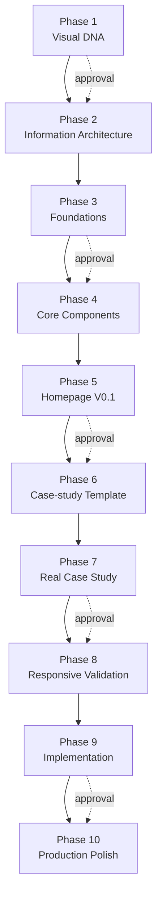
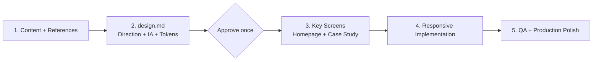

# Ellen Wang — Product Design Portfolio

A personal portfolio exploring how research, design systems, and delivery decisions bring clarity to complex enterprise products. Built with Astro and TypeScript, with a warm editorial visual style and responsive layouts.

## About the project

The portfolio introduces my work across product design, UX/UI, service design, and design-system governance. It brings selected projects, my design approach, and contact information into one site.

This repository also captures an experiment in AI-assisted design and implementation: moving from visual references and information architecture through Figma foundations, reusable components, and frontend development with Codex.

## Project goal

The goal was to create a distinctive but recruiter-friendly Product Designer portfolio that:

- communicates positioning and selected work within seconds;
- makes design reasoning visible through Evidence → Insight → Decision → Design → Outcome;
- turns one visual direction into a reusable design system and responsive codebase;
- separates public-safe evidence from confidential source material;
- documents the strengths and costs of a long, approval-gated AI design workflow.

## Current pages

| Page | Status |
| --- | --- |
| Homepage (`/`) | Selected work, profile, experience summary, and contact section |
| Enterprise Travel Platform (`/work/enterprise-travel-platform/`) | Dedicated case study covering context, research, decisions, design systems, outcomes, and reflection |
| Continuous Improvement Platform | Homepage summary; dedicated case study planned |
| Digital Checklist Discovery | Homepage summary; dedicated case study planned |

## Design direction

**Warm Technical Editorial** combines expressive typography with the structure of a technical document:

- Warm paper backgrounds, near-black text, and rust-red accents.
- Instrument Serif for editorial headings.
- IBM Plex Sans for body text and IBM Plex Mono for navigation and metadata.
- Fine dividers, generous whitespace, and a consistent grid.
- Reusable components and shared CSS design tokens.

The implementation includes mobile navigation, section anchors, a skip-to-content link, keyboard focus styles, and reduced-motion support.

Approved design source: [Portfolio Figma file](https://www.figma.com/design/22FW0RNCPZkGPtH8iIBLd2/Portfolio?node-id=0-1&t=stUGPE3vZ9OWjLt0-1).

## Built with

- **Astro** — static pages and reusable components.
- **TypeScript** — structured project and case-study content.
- **CSS** — shared design tokens and responsive layouts.
- **Fontsource** — self-hosted fonts.
- **Phosphor Icons** — interface icons.

## Skills used

| Skill | Purpose |
| --- | --- |
| `portfolio-editorial-ai-workflow` | Defined the gated Visual DNA → IA → system → page → implementation process and required explicit approval at each phase. |
| `figma-use` | Created and inspected variables, text styles, components, pages, and responsive compositions in Figma. |
| `figma-design-to-code` | Translated approved Figma frames into implementation context without redesigning them in code. |
| `product-design:image-to-code` | Implemented the approved desktop and mobile designs as a responsive Astro website. |
| `product-design:design-qa` | Compared approved visual sources and browser-rendered pages, then blocked handoff until important mismatches were fixed. |
| `browser:control-in-app-browser` | Tested navigation, responsive breakpoints, accessibility behavior, image delivery, error states, and console output. |
| `openai-docs` | Informed the investigation into long context, compaction, and token-heavy tool workflows. |

## Run locally

Requirements: **Node.js 22.12.0 or later** and **npm 9.6.5 or later**, matching the installed Astro package requirements.

From the repository folder:

```sh
npm ci
npm run dev
```

Open the local URL printed in the terminal, usually `http://localhost:4321`.

| Command | Purpose |
| --- | --- |
| `npm ci` | Install dependencies from the lockfile |
| `npm run dev` | Start the development server |
| `npm run build` | Generate the static site in `dist/` |
| `npm run preview` | Preview the production build locally |

To check the production version:

```sh
npm run build
npm run preview
```

## Project structure

```text
public/
  favicon.svg                     Browser icon
  robots.txt                      Search crawler rules
  images/                         Case-study artwork and optimised WebP
src/
  components/                     Shared portfolio components
    case-study/                   Case-study presentation components
  content/
    projects.ts                   Homepage project summaries
    enterpriseTravelPlatform.ts   Detailed case-study content
  layouts/
    SiteLayout.astro              Shared metadata, fonts, and page shell
  pages/
    404.astro                     Branded error page
    index.astro                   Homepage
    work/
      enterprise-travel-platform.astro
  styles/
    global.css                    Design tokens and responsive styles
astro.config.mjs                   Static-site configuration
```

## Update the portfolio

- Edit `src/content/projects.ts` to update selected-work summaries and links.
- Edit `src/content/enterpriseTravelPlatform.ts` to update the existing case study.
- Edit `src/pages/index.astro` to update the profile and contact sections.
- Adjust `src/styles/global.css` to change typography, colours, spacing, and layouts.
- Add artwork to `public/images/` and reference it with an `/images/` path.

New case-study pages belong in `src/pages/work/`. Reuse the shared case-study components and update the corresponding homepage project link.

## Phases 1–10

| Phase | Stage | Goal and deliverable |
| ---: | --- | --- |
| 1 | Visual DNA | Analyse references for mood, typography, colour, grid, spacing, imagery, system language, and patterns to borrow or avoid. |
| 2 | Information Architecture | Define the homepage hierarchy and the case-study narrative before styling every component. |
| 3 | Foundations | Establish semantic colours, typography, spacing, borders, radii, and the desktop grid in Figma. |
| 4 | Core Components | Build portfolio-specific components such as labels, actions, navigation items, metadata, metrics, media frames, and section headers. |
| 5 | Homepage V0.1 | Test the system with a complete desktop homepage using real, public-safe content. |
| 6 | Case-study Template | Create a reusable Evidence → Insight → Decision → Design → Outcome storytelling framework. |
| 7 | Real Case Study | Populate the template with the Enterprise Travel Platform project while separating verified, qualitative, missing, and confidential evidence. |
| 8 | Responsive Validation | Recompose the homepage and key case-study sections for mobile instead of merely shrinking the desktop layout. |
| 9 | Implementation Handoff | Map Figma tokens and components to Astro, TypeScript, and semantic CSS; build and approve the homepage and first case study. |
| 10 | Production Polish | Add metadata, favicon, robots rules, an error page, honest unpublished-project states, accessibility fixes, asset optimisation, dependency pinning, and final browser QA. |

## Original workflow



Every phase required inspection, production, screenshots, explanation, and human approval. This provided strong control over design drift, but it also became the main source of workflow overhead.

## Problem: extremely high token consumption

Token usage was much higher than expected. Reducing response length, narrowing inspections, and storing workflow state helped, but the overall consumption remained substantial.

### Why the problem occurred

1. **Too many phases.** Ten stages created repeated context reconstruction, delivery notes, screenshots, and approval turns.
2. **Figma was introduced too early.** Codex had to inspect nodes, variables, styles, component properties, and page structure before the visual direction was fully settled.
3. **Figma operations produce large context.** Even small changes depend on node IDs, variable IDs, layout data, fonts, and existing component structure.
4. **Approval gates were too granular.** Gates reduced drift, but each pause required the workflow state and prior decisions to be loaded again.
5. **Visual QA was expensive.** Desktop, mobile, homepage, case-study, and production states all required captures and comparison-based iteration.
6. **The same facts were repeated.** Chat history, Figma, PNG exports, handover notes, state JSON, and code frequently carried overlapping information.
7. **Long tool-heavy sessions accumulated context.** Repeated inspection and output remained in the working context even when only a small subset was needed for the next decision.

## Solutions applied

- Stored page IDs, component IDs, approval status, and pending validations in a compact workflow-state file.
- Read only the source files and Figma nodes needed for the active phase.
- Limited screenshot and structural inspection to critical frames, regions, and breakpoints.
- Reused semantic tokens so visual rules did not need to be reinterpreted between Figma and code.
- Created milestone handovers to make continuation more compact and reliable.
- Used focused source-versus-implementation comparison images instead of repeatedly re-reading full pages.
- Consolidated responsive and production checks into fewer browser passes.

These changes reduced waste, but they did not remove the structural cause: the workflow still had too many phases, and Figma was being used simultaneously for exploration, rule definition, page generation, and review.

## Reflection

Token consumption remained high even after the workflow was improved. Further research suggested that the more effective solution is to redesign the process rather than continue compressing each individual phase.

The next iteration should reduce the number of phases and avoid asking Codex to operate Figma at the beginning. Instead, it should first create a compact `design.md` containing the visual direction, information architecture, tokens, component rules, content hierarchy, and responsive principles. After that document is approved, the same source of truth can guide both the key screens and the frontend implementation.

Figma would then become a focused visual-review surface rather than the place where the AI explores the direction, stores every rule, builds every component, and generates every page.

## Proposed five-phase workflow



This approach reduces repeated context, shortens approval chains, and gives design and code one shared source of truth. The proposed `design.md` is a lesson for the next iteration and is not currently included in this repository.

## Publishing

The project generates a static site. Use `npm run build` and publish the resulting `dist/` folder with a static hosting provider.

The current implementation uses root-relative links and asset paths. Hosting under a GitHub Pages repository subpath requires configuring Astro's base path and updating those references before deployment. The final public domain and contact destination are intentionally left unconfigured rather than fabricated.

## Project content

Public-facing case studies use sanitised project names and abstracted visuals. The `.gitignore` excludes private source documents, résumés, offline presentations, handover notes, and local review exports.

Portfolio narratives and artwork represent personal project material. Third-party fonts, icons, and dependencies retain their respective licences.
