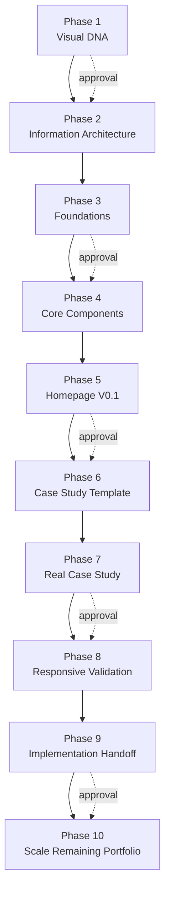
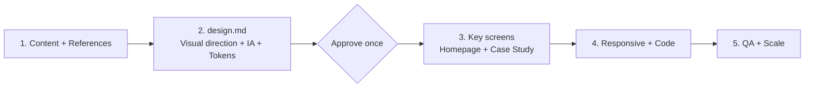

# Editorial Portfolio × Codex Workflow

This is a Product Designer portfolio experiment created with assistance from Codex. The project focuses not only on the final website, but also documents the complete process—from visual direction, information architecture, and design systems to Figma screens and responsive frontend implementation—along with the token-consumption problem encountered during a long, tool-intensive workflow.

## Project Goal

The goal was to create an editorial yet systematic personal portfolio that helps recruiters quickly understand the designer's positioning, selected work, and way of thinking. The project also needed to keep all published content safe, maintain consistent design rules, and support a reliable transition from Figma to production code.

The final direction is **Warm Technical Editorial**:

- Instrument Serif provides editorial character and expressive headings.
- IBM Plex Sans keeps body content highly readable.
- IBM Plex Mono is used for navigation, numbering, status, and system language.
- A warm paper background is paired with near-black text, rust-red accents, and amber status colours.
- Grids, fine dividers, and deliberate whitespace establish hierarchy without excessive card-based UI.
- Company names, system names, and screenshots are sanitised for public presentation.
- Figma [link]([https://www.google.com](https://www.figma.com/design/22FW0RNCPZkGPtH8iIBLd2/Portfolio?node-id=0-1&t=stUGPE3vZ9OWjLt0-1))

The current implementation includes a responsive homepage with desktop and mobile layouts, a mobile menu, anchor navigation, keyboard focus states, reduced-motion support, and semantic content structure.

## Technology Stack

- Astro
- TypeScript
- Native CSS with semantic design tokens
- Self-hosted Instrument Serif, IBM Plex Sans, and IBM Plex Mono
- Phosphor Icons

## Skills Used

| Skill | Purpose |
|---|---|
| `portfolio-editorial-ai-workflow` | The primary gated workflow, defining approval points across Visual DNA → IA → Design System → Homepage → Case Study → Responsive → Implementation. |
| `figma-use` | Created and maintained variables, text styles, components, pages, and responsive layouts in Figma. |
| `product-design:image-to-code` | Implemented approved desktop and mobile visual designs as a responsive frontend. |
| `browser:control-in-app-browser` | Validated the page, navigation, mobile menu, responsive breakpoints, and console behaviour in a real browser. |
| `openai-docs` | Verified guidance related to long context, reasoning tokens, and compaction. |

## Phases 1–10

| Phase | Stage | Goal and Deliverable |
|---:|---|---|
| 1 | Visual DNA | Analyse the references for mood, typographic roles, colour, grid, spacing, system language, and patterns to adopt or avoid. |
| 2 | Information Architecture | Define the hierarchy of the homepage, Selected Work, About, Contact, and case-study pages, using an Evidence → Insight → Decision → Design → Outcome narrative. |
| 3 | Foundations | Establish semantic colours, typography, spacing, radii, borders, and a desktop grid in Figma to form a minimal design system. |
| 4 | Core Components | Create portfolio components including System Label, Action, Navigation Item, Metadata, Metric, Section Header, Status Bar, and Media Frame. |
| 5 | Homepage V0.1 | Build the desktop homepage with real, public-safe content and verify that the design system produces a coherent visual language. |
| 6 | Case Study Template | Create a reusable case-study template covering Context, Discovery, Definition, Design, System, Outcome, and Reflection. |
| 7 | Real Case Study | Map real Enterprise Travel Platform material into the template, distinguishing content to retain, strengthen, remove, source, or keep confidential. |
| 8 | Responsive Validation | Recompose the desktop hierarchy for mobile instead of simply scaling it down, completing key homepage and case-study sections. |
| 9 | Implementation Handoff | Map Figma tokens to CSS variables and design components to code components, then complete the responsive Astro homepage and browser QA. |
| 10 | Scale | Extend the approved system across the remaining case studies, About, Contact, experiments, and production refinements. This repository currently reaches the Phase 9 homepage implementation. |

## Original Workflow



Every phase required inspection, generation, screenshots, explanation, and human approval. This improved control, but also became a major source of token cost.

## Problem: Extremely High Token Consumption

The project progressed successfully, but token usage was far higher than expected. Even after reducing output, narrowing inspection scope, and introducing a workflow-state file, total consumption remained substantial.

### Why It Happened

1. **Too many phases:** Ten phases created ten rounds of context continuation, delivery notes, screenshots, and approvals. Information from early stages continued to accumulate in later contexts.
2. **Figma was introduced too early:** Before the overall direction was settled, Codex had to read pages, locate node IDs, inspect variables, create components, capture screenshots, and make repeated corrections.
3. **Figma operations are context-intensive:** Each write depends on existing nodes, component properties, variable IDs, fonts, and layout information, so tool output grows quickly.
4. **Approval gates were too granular:** Gates reduced design drift, but every pause and continuation required the current state to be reconstructed.
5. **Visual QA was expensive:** Desktop, mobile, case-study, and implementation views all required screenshots, structural checks, privacy checks, and comparison-based fixes.
6. **The same facts appeared in multiple formats:** Figma, PNG exports, handover documents, state JSON, chat history, and code repeated overlapping information.
7. **Long-running tool use accumulated context:** Official OpenAI guidance identifies multi-step, tool-heavy work as a typical long-context and compaction scenario, and recommends compacting at major milestones instead of preserving every detail in every turn. See [OpenAI model guidance](https://developers.openai.com/api/docs/guides/latest-model).

## Solutions Applied

- Stored pages, node IDs, components, and approval status in a compact workflow-state JSON file.
- Read only the files and nodes required for the active phase.
- Limited tool output instead of repeatedly exporting the entire Figma structure.
- Restricted visual inspection to critical frames and breakpoints.
- Used semantic tokens to avoid reinterpreting colour and spacing between design and code.
- Produced handover documents at milestones so later work could continue from a compact state.
- Shortened progress updates and concentrated browser validation in the final implementation phase.

These changes reduced waste, but did not solve the structural issue: the workflow still contained too many phases, while Figma continued to serve three roles at once—early exploration, rules database, and final production surface.

## Reflection

Token consumption remained high even after these improvements. Further research and reflection suggested that the better solution was not to keep compressing each phase, but to redesign the workflow itself.

A more efficient approach would be to:

1. **Reduce the number of phases** by combining closely dependent activities.
2. **Avoid asking Codex to operate Figma at the beginning.**
3. First create a compact, reviewable `design.md` that defines the visual direction, content hierarchy, tokens, component rules, and responsive principles with text and a small number of images.
4. After the user approves `design.md`, use it as the single source of truth for producing the key screens.
5. Enter Figma only when human visual review is valuable, reducing node inspection, variable lookups, component construction, and repeated screenshots.
6. Generate the code from the same `design.md`, avoiding another complete interpretation step between Figma and implementation.

## Proposed New Workflow



The revised workflow compresses the original ten phases into five and makes `design.md` the shared source of truth for design and code. Figma is narrowed from an exploration tool, rules database, and page generator into a focused visual-review surface.

## Run Locally

```bash
npm install
npm run dev
```

Production build:

```bash
npm run build
```

## Privacy Note

This repository contains only public-safe project names, high-level outcomes, and the frontend implementation. Original employer and client names, internal system names, project codes, work links, sensitive screenshots, résumés, and offline presentation files are excluded from the public repository.
